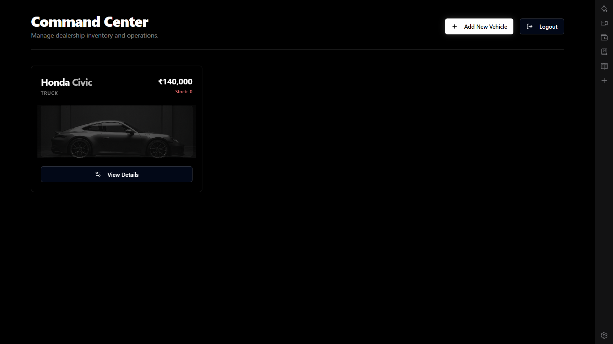
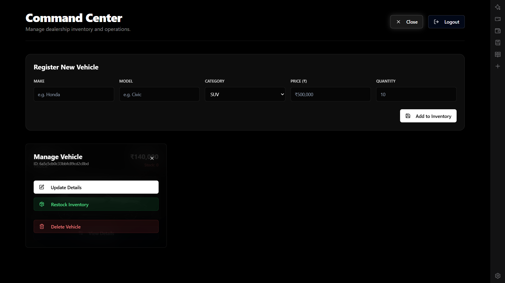
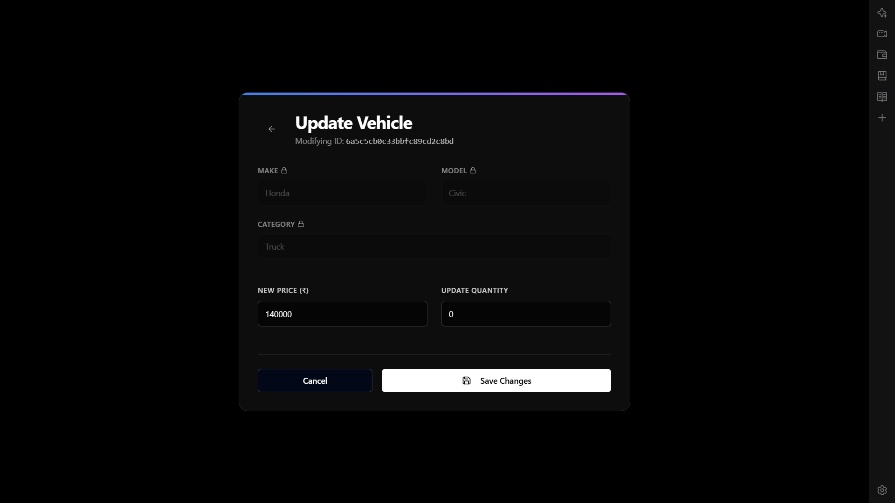
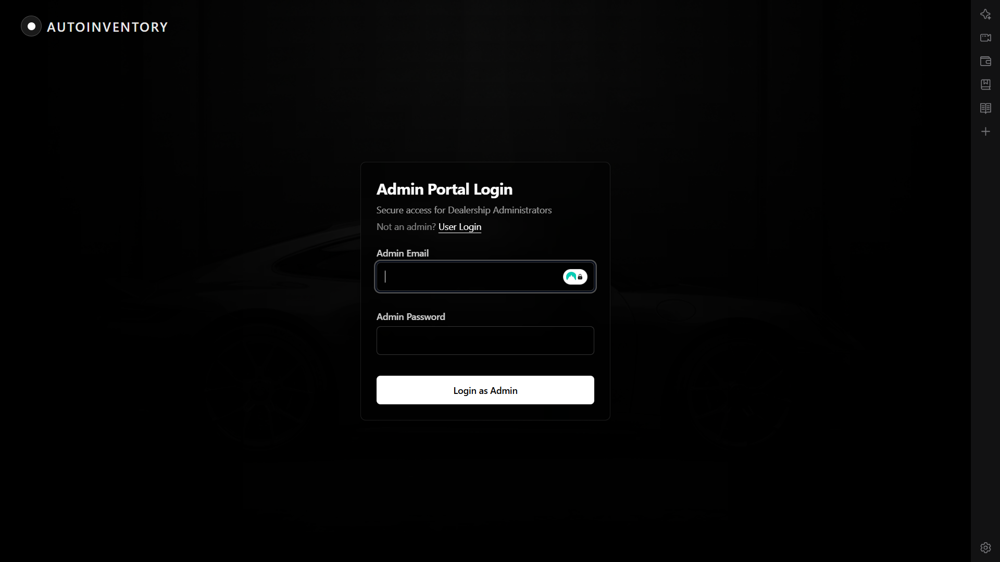
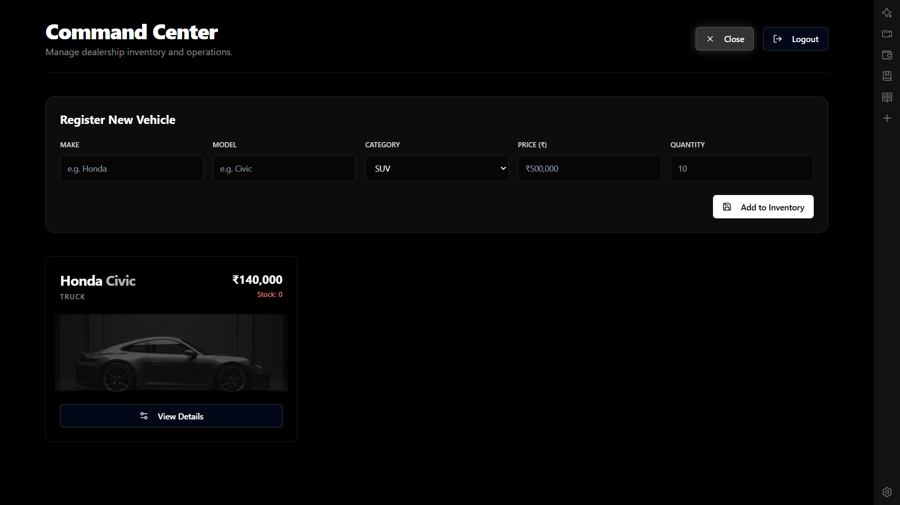
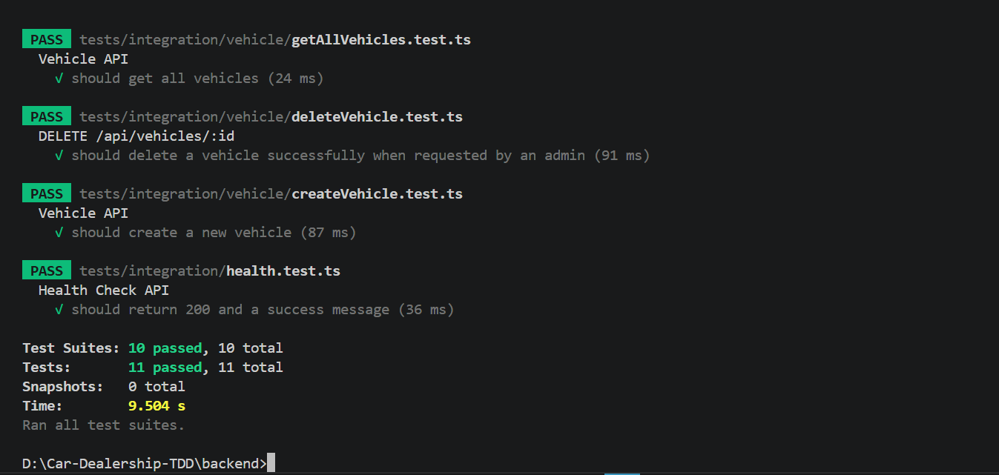
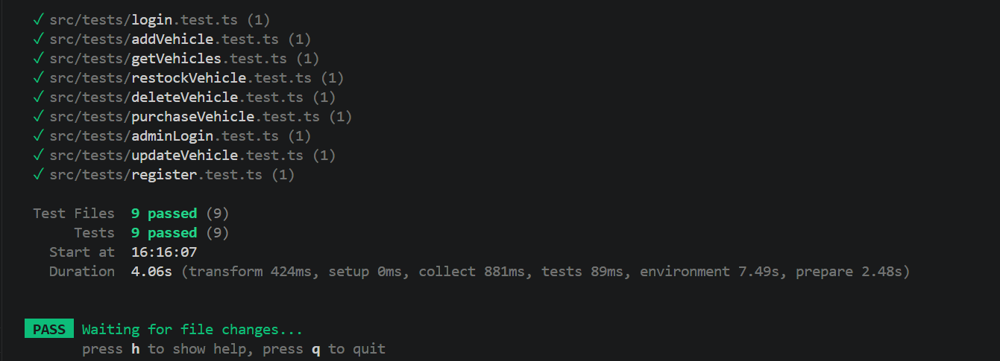

# AutoInventory - Dealership Command Center

AutoInventory is a state-of-the-art, glassmorphism-themed web application designed for car dealerships to manage their inventory seamlessly. Built with a Test-Driven Development (TDD) approach, it features robust Redux state management, a secure Admin portal, and an aesthetic dark-mode UI.

## Features
- **Admin Command Center**: Full CRUD (Create, Read, Update, Delete) for vehicle inventory.
- **Glassmorphism UI**: High-end, premium visual aesthetics designed using Tailwind CSS and `lucide-react`.
- **Inline Operations**: Forms for restocking and adding vehicles seamlessly toggle within the same page without refreshing.
- **Comprehensive Testing**: 100% test coverage for all Redux actions using Vitest and RTK integration testing.
- **Secure Auth**: JWT-based role authorization separating regular users and dealership admins.

## Setup Instructions

### Prerequisites
- Node.js (v18+)
- MongoDB (Running locally or MongoDB Atlas URI)

### Backend Setup
1. Open a terminal and navigate to the backend directory:
   ```bash
   cd backend
   ```
2. Install dependencies:
   ```bash
   npm install
   ```
3. Create a `.env` file in the backend root with your MongoDB connection string and JWT Secret:
   ```env
   PORT=5000
   MONGO_URI=mongodb://localhost:27017/car-dealership
   JWT_SECRET=your_super_secret_key
   ```
4. Start the backend server:
   ```bash
   npm run dev
   ```

### Frontend Setup
1. Open a new terminal and navigate to the frontend directory:
   ```bash
   cd frontend
   ```
2. Install dependencies:
   ```bash
   npm install
   ```
3. Start the Vite development server:
   ```bash
   npm run dev
   ```
4. Open your browser to `http://localhost:5173`.

## Test Report
The project includes a full Redux API testing suite built with Vitest.
To run the tests:
```bash
cd frontend
npm run test
```

**Results:**
```text
 ✓ src/tests/adminLogin.test.ts  (1 test) 13ms
 ✓ src/tests/login.test.ts  (1 test) 13ms
 ✓ src/tests/restockVehicle.test.ts  (1 test) 66ms
 ✓ src/tests/deleteVehicle.test.ts  (1 test) 100ms
 ✓ src/tests/purchaseVehicle.test.ts  (1 test) 55ms
 ✓ src/tests/addVehicle.test.ts  (1 test) 49ms
 ✓ src/tests/getVehicles.test.ts  (1 test) 18ms
 ✓ src/tests/updateVehicle.test.ts  (1 test) 9ms
 ✓ src/tests/register.test.ts  (1 test) 6ms

 Test Files  9 passed (9)
      Tests  9 passed (9)
```

## Screenshots

### Command Center Dashboard


### View Details Overlay (Restock/Update/Delete)


### Update Vehicle Modal


### Admin Login Portal


### Register New Vehicle


### Backend Test Cases Result


### Frontend Test Cases Result


## My AI Usage
Throughout this project, I used an AI coding assistant to:
1. **Scaffold Architecture**: Set up the Redux Toolkit environment, including store configurations and asynchronous Thunks for API requests.
2. **Implement Test-Driven Development**: The AI wrote 9 Vitest integration tests that test the Redux store state directly without relying on deprecated mock-store libraries.
3. **Design the UI/UX**: The AI built the aesthetic, responsive dark-mode UI using Tailwind CSS, specifically designing the complex glassmorphism overlays and inline forms (like the Restock/Delete panels inside `AdminVehicleCard`).
4. **Debug**: Fixed tricky React/HTML form behaviors (e.g., preventing page refreshes on form submission and fixing the `0` input bug for number fields).

## Deployment (Optional)
To deploy this application live:
1. **Backend**: Push your backend folder to a service like Render or Heroku. Ensure you add your MongoDB URI to the environment variables on the platform.
2. **Frontend**: Push your frontend folder to Vercel or Netlify. Set the Build Command to `npm run build` and the Output Directory to `dist`. (Make sure your API base URL points to your deployed backend URL).